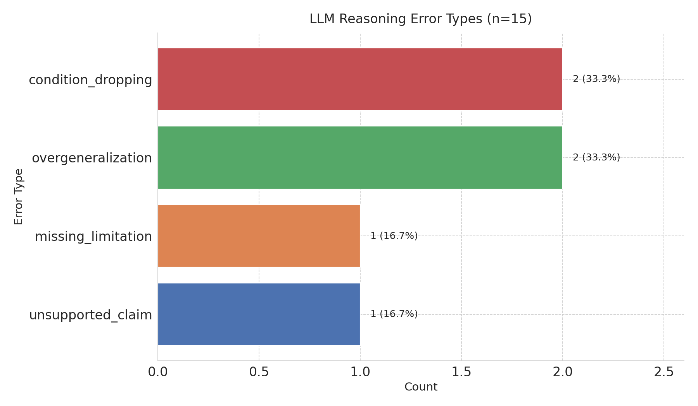
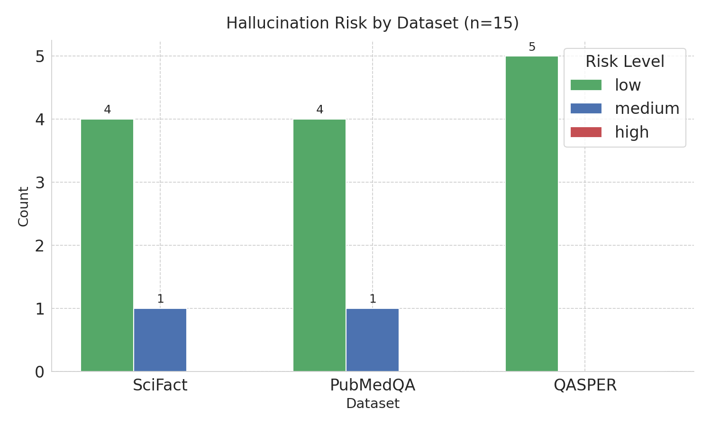
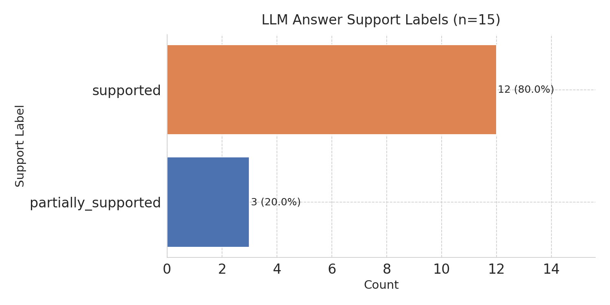
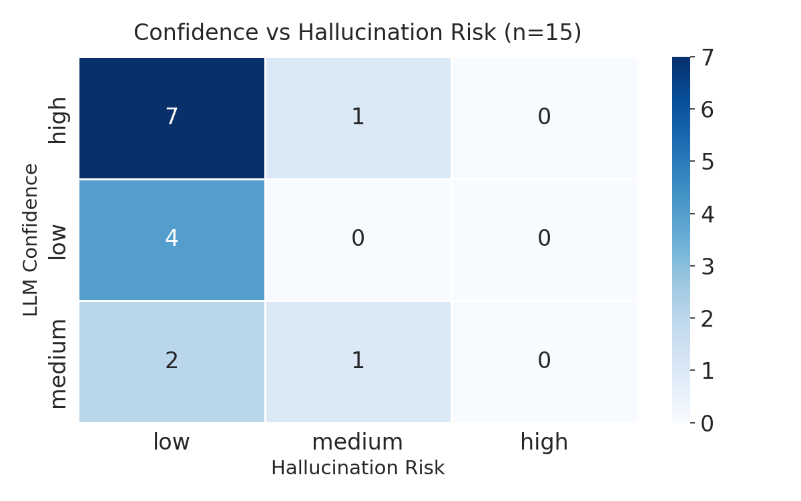

# EvidenceLens

> Prototype evaluation framework for LLM scientific reasoning and evidence conflict detection.

## Goal

LLMs can produce fluent but unsupported scientific explanations. EvidenceLens tests whether
LLM-generated answers are grounded in source evidence, preserve uncertainty and limitations,
and detect conflicts across documents — rather than producing plausible but unsupported reasoning.

## Datasets

| Dataset               | Role                               | Records audited | Gold Labels                         |
|-----------------------|------------------------------------|-----------------|-------------------------------------|
| SciFact               | Scientific claim verification      | 67              | support / contradict                |
| PubMedQA              | Biomedical yes/no/maybe QA         | 67              | yes / no / maybe                    |
| QASPER                | Research paper QA                  | 66              | see_answer (extractive/free-form)   |
| Manual conflict pairs | Multi-document conflict detection  | 5               | conflict_or_conditionally_supported |

## Pipeline

```
raw data (SciFact / PubMedQA / QASPER)
        |
        v
normalize_{dataset}.py
        |
        v
diagnostic_combined_sample.jsonl  (200 records)
        |
        v
run_answer_generation.py  -->  answer_generation_outputs.jsonl
        |
        v
run_evidence_audit.py     -->  evidence_audit_outputs.jsonl
        |
        v
run_conflict_audit.py     -->  conflict_audit_outputs.jsonl  (5 conflict pairs)
        |
        v
export_error_table.py     -->  error_analysis_table.csv
plot_error_summary.py     -->  error_type_counts.png
                               hallucination_risk_by_dataset.png
                               support_label_distribution.png
                               confidence_vs_risk_heatmap.png
```

## Error Taxonomy

| Error Type                | Definition                                                         |
|---------------------------|--------------------------------------------------------------------|
| unsupported_claim         | LLM makes a claim not supported by the source text                 |
| wrong_evidence            | LLM cites irrelevant or incorrect evidence                         |
| missing_evidence          | LLM gives answer but no source-grounded support                    |
| overgeneralization        | LLM expands a narrow result into a broad claim                     |
| condition_dropping        | LLM removes study conditions, dataset limits, or population limits |
| false_certainty           | LLM says yes/no when evidence is uncertain or maybe                |
| missing_limitation        | LLM ignores limitations stated or implied in source                |
| contradiction_with_source | LLM answer conflicts with source text                              |
| conflict_ignored          | In multi-document setting, LLM hides disagreement                  |
| paper_section_misread     | LLM pulls evidence from wrong section or wrong context             |

## How to Run

### Setup

```bash
bash setup_env.sh      # or setup_env.bat on Windows
cp .env.example .env
# Edit .env and add your ANTHROPIC_API_KEY
```

### Run in order

```bash
python scripts/download_qasper.py

python src/evidencelens/data/normalize_scifact.py
python src/evidencelens/data/normalize_pubmedqa.py
python src/evidencelens/data/normalize_qasper.py
python src/evidencelens/data/build_diagnostic_dataset.py

python src/evidencelens/audit/run_answer_generation.py
python src/evidencelens/audit/run_evidence_audit.py
python src/evidencelens/audit/run_conflict_audit.py

python src/evidencelens/eval/export_error_table.py
python src/evidencelens/viz/plot_error_summary.py
```

### Verify combined sample

```python
python -c "
import jsonlines
from collections import Counter
rows = list(jsonlines.open('data/processed/samples/diagnostic_combined_sample.jsonl'))
print(Counter(r['source_dataset'] for r in rows))
assert len(rows) == 200
print('PASS')
"
```

---

## Results (Full Run — n=200 + 5 conflict pairs)

### Key metrics

| Metric                              | Value                  |
|-------------------------------------|------------------------|
| Records audited                     | 200                    |
| — SciFact                           | 67 (33.5%)             |
| — PubMedQA                          | 67 (33.5%)             |
| — QASPER                            | 66 (33%)               |
| Records with detected errors        | 49 / 200 (24.5%)       |
| **Support labels**                  |                        |
| supported                           | 145 / 200 (72.5%)      |
| partially_supported                 | 34 / 200 (17.0%)       |
| insufficient                        | 9 / 200 (4.5%)         |
| contradicted                        | 6 / 200 (3.0%)         |
| uncertain                           | 4 / 200 (2.0%)         |
| **Hallucination risk**              |                        |
| low                                 | 164 / 200 (82.0%)      |
| medium                              | 31 / 200 (15.5%)       |
| high                                | 3 / 200 (1.5%)         |
| **LLM confidence**                  |                        |
| high                                | 121 / 200 (60.5%)      |
| medium                              | 28 / 200 (14.0%)       |
| low                                 | 49 / 200 (24.5%)       |
| **Boolean audit flags**             |                        |
| overgeneralization = true           | 21 / 200 (10.5%)       |
| false_certainty = true              | 16 / 200 (8.0%)        |
| limitation_preserved = false        | 28 / 200 (14.0%)       |
| **Conflict detection**              |                        |
| Conflicts correctly detected        | 5 / 5 (100%)           |
| Forced consensus (conflict hidden)  | 0 / 5 (0%)             |

### Error type distribution



**All error type occurrences across 200 records (94 total instances in 49 records):**

| Error Type                | Occurrences | % of all errors |
|---------------------------|-------------|-----------------|
| overgeneralization        | 21          | 22.3%           |
| missing_evidence          | 16          | 17.0%           |
| false_certainty           | 15          | 16.0%           |
| condition_dropping        | 15          | 16.0%           |
| missing_limitation        | 10          | 10.6%           |
| unsupported_claim         | 8           | 8.5%            |
| conflict_ignored          | 6           | 6.4%            |
| paper_section_misread     | 2           | 2.1%            |
| contradiction_with_source | 1           | 1.1%            |

**Per-dataset top errors:**

| Dataset  | Records | High risk | Top error types (occurrences)                                    |
|----------|---------|-----------|------------------------------------------------------------------|
| SciFact  | 67      | 2         | overgeneralization:11, missing_evidence:7, condition_dropping:6  |
| PubMedQA | 67      | 1         | false_certainty:8, overgeneralization:8, missing_limitation:8    |
| QASPER   | 66      | 0         | missing_evidence:5, false_certainty:3, condition_dropping:3      |

### Hallucination risk by dataset



### Support label distribution



### Confidence vs hallucination risk



### Key finding

Across 200 audited records, 60.5% of LLM answers carried high self-reported confidence, yet
17% of all records (34) received medium or high hallucination risk from the auditor. This
persistent gap between confidence and faithfulness is the core pattern EvidenceLens is designed
to surface. Scope-related failures dominate: `overgeneralization` and `condition_dropping`
together account for 38.3% of all detected error instances — the LLM consistently broadens
narrow study results beyond their stated conditions. `false_certainty` and `missing_evidence`
each account for ~16%, driven especially by PubMedQA's yes/no/maybe questions where uncertain
evidence invites overconfident conclusions.

### Interpretation

QASPER produced the lowest error rate (0 high-risk records, fewest error instances) because
paper-QA questions with extractive or free-form answers lack a strict binary correct/incorrect
boundary — the audit compares LLM reasoning to paper content rather than a definitive label.
SciFact produced the most errors (overgeneralization dominant) because claim-verification
requires precise alignment with binary support/contradict labels, making over-broad claims
immediately detectable. The conflict detection result (5/5 detected, 0 forced consensus)
indicates the model acknowledged disagreement in every hand-crafted conflict pair, though
this is measured by the model auditing its own answer in the same generation pass and cannot
be taken as independent verification.

### Limitation

All audit metrics — `support_label`, `hallucination_risk`, `overgeneralization`,
`false_certainty`, `limitation_preserved`, `error_types`, `conflict_detected`, and
`forced_consensus` — are produced by an LLM judging either its own output or another LLM's
output. No rule-based or deterministic verification layer exists. A model biased toward
self-approval will systematically underreport errors. Additionally, the evidence audit prompt
exposes the `gold_label` to the auditing model before it renders judgment, which may inflate
`support_label` accuracy. These limitations are inherent to the LLM-as-judge evaluation
paradigm and must be accounted for when interpreting any result from this pipeline.

---

## Outputs

| File                                                       | Description                              |
|------------------------------------------------------------|------------------------------------------|
| data/processed/samples/diagnostic_combined_sample.jsonl    | 200 normalized records (67+67+66)        |
| outputs/predictions/answer_generation_outputs.jsonl        | LLM answers for all 200 records          |
| outputs/predictions/evidence_audit_outputs.jsonl           | Audit results for all 200 records        |
| outputs/predictions/conflict_audit_outputs.jsonl           | Conflict handling results (5 pairs)      |
| outputs/tables/error_analysis_table.csv                    | Per-record error analysis (200 rows)     |
| outputs/tables/error_summary_by_dataset.csv                | Dataset-level summary (3 rows)           |
| outputs/figures/error_type_counts.png                      | Error type distribution (n=200)          |
| outputs/figures/hallucination_risk_by_dataset.png          | Risk by dataset (n=200)                  |
| outputs/figures/support_label_distribution.png             | Support label distribution (n=200)       |
| outputs/figures/confidence_vs_risk_heatmap.png             | Confidence vs risk heatmap (n=200)       |

## Status

Full run — 200 audited records across SciFact (67), PubMedQA (67), and QASPER (66).
5 manually constructed conflict pairs for multi-document conflict detection.
Pipeline complete end-to-end.
